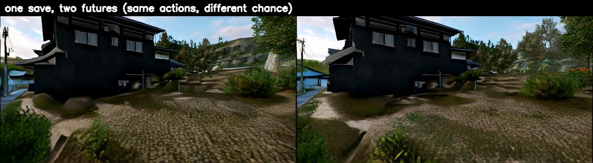

# 🦋 Butterfly

**A game played inside a neural world model — where the world is a file you can save, rewind and fork, and chaos is a measured opponent.**

<p align="center">
  <a href="https://lixuan27.github.io/butterfly/"></a>
  <br><em>one save, two futures — same actions, different chance · <a href="https://lixuan27.github.io/butterfly/">see it move →</a></em>
</p>

Neural game engines (Genie, Oasis, Matrix-Game, MIRA…) generate every frame with a video
model. That means there is no scene graph and no entity list — the *only* place the world
exists is the model's runtime state. **Butterfly** makes that state a first-class object:

- **`.wsave`** — serialize the complete runtime state (4 KV-cache groups + streaming-VAE
  conv cache + latent window + action history + RNG) and resume a world **bit-for-bit**.
- **A timeline tree** — anchors, rewind, and forking as a playable UI.
- **A game whose rules are the model's physics** — chaos half-life, memory window,
  positional-encoding lifetime. Nothing is scripted; everything is measured first.

This is, to the best of our knowledge (two collision sweeps, 2026-07), the first public
save/rewind/fork system for neural games. Nearest neighbours are in LLM serving
([Execution-State Capsules](https://arxiv.org/abs/2606.20537), whose "KV-only restore
diverges" finding our full-state contract confirms) and KV-memory
([WorldKV](https://arxiv.org/abs/2605.22718)).

## The objective — Hold the Dream

The default run has an explicit goal. **Explore 10 moves** (that walk becomes the
*original timeline*), then **THE TEAR**: fate re-rolls and chaos starts pulling the world
away. **Hold it for 10 moves** — pushing the world further than chaos itself (drift >
1.25× the measured baseline) is a strike, three strikes and the dream tears. Survive and
you're graded S/A/B/C against the measured chaos curve. The frame's border burns
green→red with live drift (a nod to [Hansen & Wang's](https://www.nicklashansen.com/mmbench2/)
live hallucination detectors — they dare you to *break* their world; here, chaos breaks
ours and you *hold* it).

## The four modes

| | mode | the rule it's built on |
|---|---|---|
| ⚔ | **Anchor Duel** — fate re-rolls, you steer the world back toward your original timeline, split-screen against your own ghost | score is graded against the *measured* chaos curve; copying your old inputs scores ≈ 0 — you must steer against the drift |
| 🦋 | **One Flap** — the saved RNG replays bit-exact; you may change exactly one action | everything that differs afterwards is your ripple; verdict = your flap vs a full re-roll of fate |
| ⇩ | **Relay** — hand your `.wsave` to a friend; they continue your dream | multiplayer with zero netcode |
| ☁ | **Lucid** — free roam, anchor, branch, inspect the dream's 2.7 GB body | any photo can become a world |

## SaveBench — the measurements

The save button doubles as an instrument. First numbers (Matrix-Game-2.0, 1×H200, all
reproducible from `src/bench/`):

| measurement | result |
|---|---|
| M1 · resume fidelity | full-state save **2,740 MB → PSNR ∞ (bit-exact)** · naïve int8 1,903 MB → 13.5 dB (*the cache is far more fragile than weights*) |
| M3 · minimal sufficient state | re-prime saves: 2.5 MB → 24.4 dB · 2.8 → 26.3 · 3.5 → 36.2 · **4.8 MB → 41.8 dB ≈ int8 at 1/400th the size**; the curve hasn't saturated — the state remembers more than the visible latents |
| M2 · fork divergence | chaos half-life **T½ = 109.5 frames (4.4 s)** · controllability SNR **3.55** (an action separates worlds 3.55× faster than chance) |
| throughput | 29.5 fps @ 352×640, single GPU, VRAM 13.9 GB |

Honest negatives we kept: per-tensor int8 quantization destroys the world; re-prime saves
decay over horizon (30.8 → 13 dB) — direct evidence of hidden memory in the cache beyond
the pixel window; in Duel, mimicking your ghost's inputs scores ≈ 0 by construction.

## Play

**Hosted**: the game server is live at
[huggingface.co/spaces/Recharge23/butterfly](https://huggingface.co/spaces/Recharge23/butterfly)
(one-seat queue + live spectators) — in landing mode while a GPU grant is pending.

**Locally**: you need one NVIDIA GPU (≥ 24 GB), Python ≥ 3.10, PyTorch ≥ 2.5 with CUDA, and ~30 GB disk.

```bash
git clone https://github.com/lixuan27/butterfly && cd butterfly
pip install -r requirements.txt
bash scripts/get_matrix_game.sh   # clones Matrix-Game-2 source + downloads weights (~28 GB)
bash scripts/serve.sh             # → http://localhost:7860
```

`WASD` walk · `IJKL` look · `⚓` anchor · `⚔` duel · `🦋` flap · `⇩` relay.
Actions land once per world-move (~0.5 s): the dream has inertia — every mode is a
steering game, not a twitch game. Dreams live 164 s (the RoPE budget), then collapse.

Tests: `python -m unittest tests.test_game_cpu` plus script-style
`python tests/test_state_cpu.py` etc. run on CPU; `tests/test_server_e2e.py` and
`tests/test_butterfly_e2e.py` need a GPU.

## How it was built

Built in the open, fast, with an AI research agent (Claude) doing the engineering legwork
under human direction — scouting → measurements → game, with every dead end kept:

- **Day 0** — landscape scan (30+ small neural-game projects), two collision sweeps: nobody
  had built save/load/fork for neural games. Decision: the gap *is* the game.
- **Day 1** — `.wsave` + host adapter. P0 gate: 29.5 fps, deterministic replay, **bit-exact
  disk resume** on first try (after two instructive failures — a `set -u`×conda footgun and
  an httpx-client zombie). M1/M2/M3 first numbers, < 2 GPU·hours total.
- **Day 2** — the game: Duel/Flap/Relay/Lucid, browser UI, GPU e2e green; scoring
  calibrated so mimicry = 0. This site.

Full protocol details in [`docs/`](docs/) — measurement specs, game design, and the
work log with every failed job and why.

## Layout

```
src/savepoint/   .wsave state capture/restore, timeline DAG, host protocol
src/server/      game state machine + FastAPI/WebSocket transport
src/bench/       M1/M2/M3 measurement harness (SaveBench)
web/             the game UI (single file, no build step)
tests/           CPU unit tests + GPU e2e
docs/            this site + specs
```

## Roadmap

Hosted playable demo · 4.8 MB re-prime relay · second host (long-memory model) ·
H1: *does few-step distillation trade away the butterfly effect?* (teacher and student
checkpoints ship in the same MG2 repo — a natural experiment pair).

## Credits & license

World model: [Matrix-Game-2.0](https://github.com/SkyworkAI/Matrix-Game) (Skywork, MIT),
of the [Self-Forcing](https://github.com/guandeh17/Self-Forcing) lineage.
Butterfly code: **MIT** © 2026 [@lixuan27](https://github.com/lixuan27).
If this is useful in your research, see [`CITATION.cff`](CITATION.cff).
